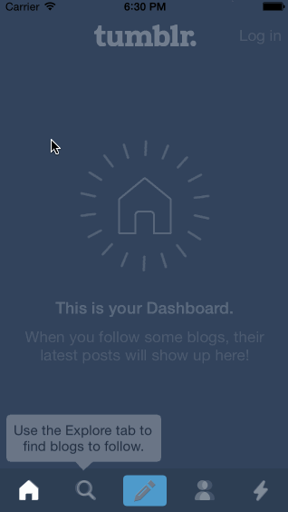

CodePath Week 4 Homework - Tumblr Prototype
============================================

Tumblr tab transition, compose animation, login view

Total hours: 6

#### All required stories ####
* Tapping on all tabs
* Show compose view modally

#### All option stories ####
* Fade in compose with animating buttons
* Animate in login (both compose & login use a single TransitionManager)
* Display "explore" bubble until Search Tab is clicked

GIF created with [LICEcap](http://licecap.en.softonic.com/ "Download LICEcap").
